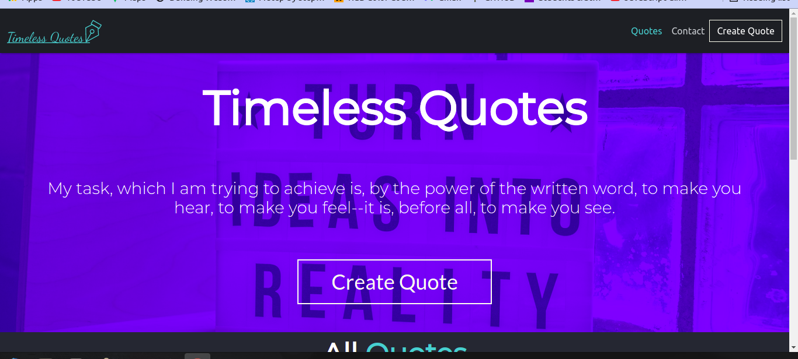
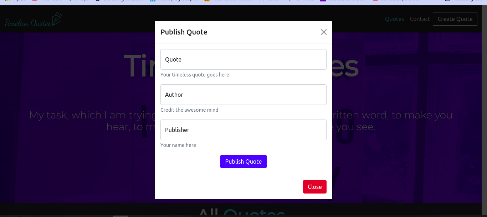
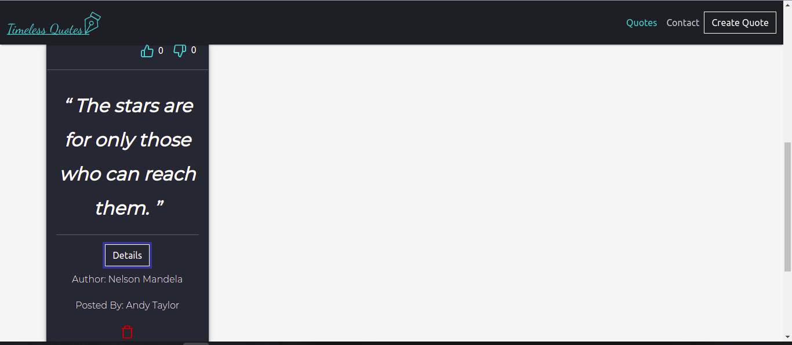

# Quote Generator
This is a web app that enables a user to view posted quotes, post their own quotes, upvote and downvote posted quote and delete any of the posted quotes
#### By Cheboi Derrick
## Description
This is an application where users can create quotes and have those quotes voted on whether they are terrible or are inspirational
The user should also be able to:
- Create a new quote.
- Upvote or downvote a quote.
- Delete a quote
- See the number of upvotes and number of downvotes for each quote.

## Screenshots
- Landing Page
    
- Create quote form
    
- Quote Details and delete
    

## Setup and Installation Requirements
* Copy the repo [link](https://github.com/CheboiDerrick/angular-quote-generator)
* Clone on your computer
* Run the following commands on your command line
    - ``npm install``
    - `ng serve`
* Open the app to the on your preferred browser `http://localhost:4200`

You need to have an angular environment set up on your end device

## Known Bugs
There are no known bugs so far.

## Technologies Used
The website has been developed using the following:
- Angular 12.2.0
- Bootstrap
- You can also live view the website [here](https://naughty-neumann-be280d.netlify.app/)

## Support and contact details
Feel free to give suggestions or bugs and possible suggestions through:
- *derrickchb@gmail.com*
### License
[MIT](https://github.com/CheboiDerrick/angular-quote-generator/blob/main/LICENSE)
Copyright (c) 2021

